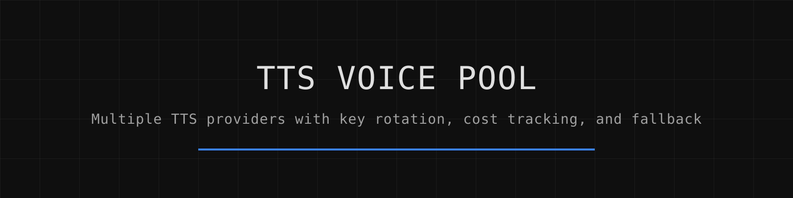

# TTS Voice Pool

_Русская версия: [README.ru.md](README.ru.md)_

**Speak through several TTS providers from one call — for AI agents (Hermes Agent, Telegram bots).** Keys rotate when one is rate-limited,
a designed voice falls back to a prebuilt one when it expires, the pace is capped at a rate a
human can listen to, and every synthesis is priced in a ledger so a free tier that
started billing cannot stay invisible.


[](.github/workflows/tests.yml)




## Overview

I run a scheduled assistant that speaks on a daily basis — briefings, alerts, reminders. A scheduled job has nobody to ask when the voice fails, so every failure that used to need a human decision became a decision the code makes on its own. This package handles key rotation, voice fallback, pace control, and cost tracking.

## Architecture

The pool implements several mechanisms to ensure reliable speech synthesis:

- **Key rotation with memory**: Each key has state tracking when it last worked, when it's resting after a 429 error, and whether it's permanently dead. Keys are tried in order of recent success, so a healthy pool converges on one working key instead of cycling.

- **Cooldown management**: After a 429 rate-limit error, keys rest for 5 minutes instead of being hammered immediately or blacklisted for too long. Resting keys are moved to the end of the queue but still attempted if all keys are resting.

- **Model chain fallback**: Models are configured in a chain (default: `gemini-2.5-flash-preview-tts`) so if one fails, the system tries the next one. The chain is defined in a one-line file making rollbacks trivial.

- **Voice fallback mechanism**: Designed voices that fail for reasons other than quota/dead errors are retried once with a prebuilt fallback voice. Quota errors are not masked by retrying.

- **Cost tracking and budget enforcement**: Every successful synthesis is logged with character count, duration, tokens used, and theoretical cost. A monthly budget cap prevents unexpected charges — once the cap is reached, subsequent calls go to the free fallback engine.

- **Pace control**: Articulation is measured as characters divided by (total seconds minus detected silence). If above the ceiling (default 12.3 chars/s), audio is stretched with `atempo` to meet the limit, with a minimum stretch factor of 0.72 to avoid audible distortion.

## Features

- CLI interface: `--check`, `--say`, `--say-file`, `--usage`
- Library interface: `from tts_voice_pool import say`
- Key pool with persistent state
- Model chain configuration
- Pace limiting with audio stretching
- Cost ledger with monthly reporting
- Free fallback via edge-tts
- Proper exit codes for cron jobs

## Quick Start

```bash
pip install -e ".[edge]"
```

## Installation

```bash
git clone https://github.com/ipanalytics/TTS-Voice-Pool
cd TTS-Voice-Pool
python -m pip install -e ".[edge]"     # edge-tts is the optional free fallback
```

`ffmpeg` and `ffprobe` must be on `PATH`: they measure the pace and encode the container. No
other runtime dependency — the HTTP calls use the standard library.

## Usage

```bash
# Basic usage
tts-voice-pool --say "Good morning. Three things on today's list." briefing.ogg

# Check available keys
tts-voice-pool --check

# View usage statistics
tts-voice-pool --usage

# Process text from a file
tts-voice-pool --say-file input.txt output.mp3
```

## Outputs/artifacts

The system creates several output files:

- Audio files in the requested format (ogg, mp3, wav, etc.)
- `~/.hermes/data/tts_pool_state.json` - key states with last success, cooldowns, etc.
- `~/.hermes/data/tts_pool_usage.jsonl` - line-delimited JSON logs of each synthesis
- Temporary processing files that are cleaned up after processing

## Configuration

| Setting | Environment | File (in `$TTS_POOL_HOME/data`) | Default |
|---------|-------------|---------------------------------|---------|
| Base directory | `TTS_POOL_HOME`, then `HERMES_HOME` | — | `~/.hermes` |
| Key pool | `GEMINI_API_KEYS`, `TTS_POOL_KEYS_FILE` | `.gemini_tts_keys` | empty |
| Default voice | `TTS_POOL_VOICE` | `tts_pool_voice.txt` | `Kore` |
| Delivery notes | — | `tts_pool_style.txt` | empty |
| Tempo multiplier | — | `tts_pool_tempo.txt` | `1.0` (clamped 0.5–2.0) |
| Pace ceiling, chars/s | — | `tts_pool_max_rate.txt` | `12.3` (0 disables) |
| Model chain | — | `tts_pool_model.txt` | `gemini-2.5-flash-preview-tts` |
| Monthly cap, USD | — | `tts_pool_budget.json` (`{"cap_usd": 5}`) | `0` (no cap) |
| Free fallback voice | `TTS_POOL_EDGE_VOICE` | — | `ru-RU-SvetlanaNeural` |
| Request timeout, s | `TTS_POOL_TIMEOUT` | — | `90` |

## Operational notes

- API keys are read on every call and never written to state files, allowing different permission schemes
- Cooldown period after 429 errors is 300 seconds (5 minutes)
- Designed voices that expire fall back to prebuilt voices automatically
- Audio pace is measured excluding detected silence (-35 dB threshold, 0.35s minimum)
- Minimum stretch factor is 0.72 to prevent audible distortion from excessive slowing
- Free fallback engine (edge-tts) ensures no silent episodes when all paid keys fail

## Project scope

This package provides a small layer between "I have several keys and a text" and "a playable file came out", with failure paths written down and a free fallback that keeps scheduled jobs from going silent. It is not a streaming synthesizer, not a local model runner, not a voice cloner.

## Use cases

- Scheduled voice briefings and notifications
- Automated podcast generation
- Voice alerts for monitoring systems
- Any application requiring reliable TTS with fallback mechanisms
- Cost-controlled speech synthesis with budget enforcement

## Limitations

- Only supports Gemini API for paid TTS and edge-tts for free fallback
- Requires ffmpeg/ffprobe to be installed separately
- No streaming synthesis - files are generated entirely before delivery
- Designed voice expiration detection is limited to failure patterns
- Budget enforcement relies on accurate cost estimation rather than actual billing data

## Repository layout

```
tts_voice_pool/
├── __init__.py       # Main entry point and public API
├── pool.py          # Key rotation and state management
├── speech.py        # TTS provider communication and synthesis
├── config.py        # Configuration handling and defaults
├── ledger.py        # Usage tracking and cost calculation
└── audio.py         # Audio processing and pace control
tests/
├── test_pool.py     # Key pool functionality tests
├── test_speech.py   # Speech synthesis tests
└── test_audio.py    # Audio processing tests
```

## Testing

```bash
python -m pytest -q      # 43 passed
python -m ruff check .   # clean
```

No network and no audio hardware in the tests: HTTP is stubbed, the pace maths is checked
against known numbers, and every test gets its own `$TTS_POOL_HOME`, so a test run cannot touch
a real ledger or a real key file. What the tests do **not** prove is that a given key still
works — that is exactly what `--check` is for.

## Deployment

For production use, ensure:
- ffmpeg and ffprobe are available in PATH
- API keys are properly secured
- Budget limits are set appropriately
- Cron jobs use proper exit code handling
- State and usage files have appropriate permissions

## License

MIT — see [LICENSE](LICENSE).

## Disclaimer

This package is designed for reliable speech synthesis with fallback mechanisms. I monitor costs and usage carefully to prevent unexpected charges. Use at your own risk and always set appropriate budget limits.
